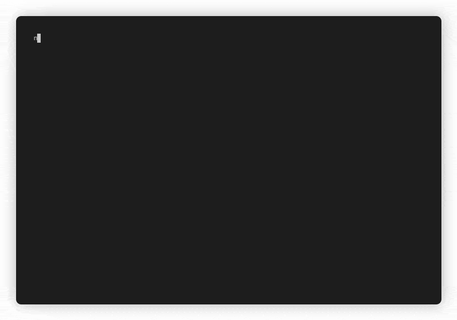

# ntfs Rust crate

[](https://crates.io/crates/ntfs)
[](https://docs.rs/ntfs)


*by Colin Finck <<colin@reactos.org>>*

A low-level NTFS filesystem library implemented in Rust.

[NTFS](https://en.wikipedia.org/wiki/NTFS) is the primary filesystem in all versions of Windows (since Windows NT 3.1 in 1993).
This crate is geared towards the NTFS 3.x versions used in Windows 2000 up to the current Windows 11.
However, the basics are expected to be compatible to even earlier versions.

The crate is `no_std`-compatible and therefore usable from firmware level code up to user-mode applications.

## ntfs-shell


The `ntfs-shell` example comes with this crate to demonstrate all library features.
Use it to explore the internal structures of an NTFS filesystem at any detail level, even of your running Windows partition.
No artificial security restrictions will block you from accessing a file or folder, extract their data, as well as Alternate Data Streams.
The filesystem is opened read-only, so you can safely browse even a mounted filesystem without worrying about data corruption.
That is also helpful to get an idea of the Windows NTFS driver, e.g. to find out when its lazy writer actually updates the data on disk.

I originally wrote `ntfs-shell` for myself to comfortably develop the library in user-mode before running the code in production in kernel-mode.

To build `ntfs-shell`, just clone this repo and call

```
cargo build --example ntfs-shell --all-features
```

To run it, pass the path to an NTFS image (on all operating systems) or to a partition (like `\\.\C:`, on Windows only with administrative privileges) to the resulting `ntfs-shell` binary.

Calling `help` gives you a list of all supported commands.
`help COMMAND` details the syntax of that command.

Most commands that take a filename also take an NTFS File Record Number (if prepended by `/`).
This File Record Number may be decimal or hexadecimal (if prepended by `0x`).
Some examples:

```
fileinfo Windows
fileinfo /146810
fileinfo /0x23d7a
```

## Library Features
* For the impatient: Convenience functions to treat NTFS like any other filesystem and just read files and directories using `Read`/`Seek` traits.
  At your option, you may also explore the filesystem at any detail level.
* Reading arbitrary resident and non-resident attributes, attributes in Attribute Lists, and attributes connected over multiple Attribute List entries, including sparse attribute data.
  All of this together enables reading file data and Alternate Data Streams of any size and on-disk structure.
* Iterating over a flattened "data-centric" view of the NTFS Attributes, abstracting away any nested Attribute List.
* Efficiently finding files in a directory, adhering to the filesystem's $Upcase Table for case-insensitive search.
* In-order iteration of directory contents at O(1).
* Leveraging Rust's typesystem to handle the various types of NTFS indexes in a typesafe way.
* Error propagation through a custom `NtfsError` type that implements `Display`.
  Where it makes sense, variants have additional fields to pinpoint any error to a specific location.
* Full functionality even in a `no_std` environment with `alloc`.
* No usage of `unsafe` anywhere. Checked arithmetic where needed.
* Platform and endian independence.

## Not yet supported
* Any write support
* Caching for better performance
* Compression
* Encryption
* Journaling
* Quotas
* Reparse Points
* Security Descriptors

## Examples
The following example dumps the names of all files and folders in the root directory of a given NTFS filesystem.  
The list is directly taken from the NTFS index, hence it's sorted in ascending order with respect to NTFS's understanding of case-insensitive string comparison.

```rust,no_run
let mut ntfs = Ntfs::new(&mut fs).unwrap();
let root_dir = ntfs.root_directory(&mut fs).unwrap();
let index = root_dir.directory_index(&mut fs).unwrap();
let mut iter = index.entries();

while let Some(entry) = iter.next(&mut fs) {
    let entry = entry.unwrap();
    let file_name = entry.key().unwrap();
    println!("{}", file_name.name());
}
```

Check out the [docs](https://docs.rs/ntfs), the tests, and the supplied `ntfs-shell` application for more examples on how to use the `ntfs` library.

## License
This crate is licensed under either of

 * [Apache License, Version 2.0](http://www.apache.org/licenses/LICENSE-2.0)
 * [MIT license](http://opensource.org/licenses/MIT)

at your option.

Unless you explicitly state otherwise, any contribution intentionally submitted for inclusion in the work by you, as defined in the Apache-2.0 license, shall be dual licensed as above, without any additional terms or conditions.

## Further Resources
* [flatcap.github.io linux-ntfs documentation](https://flatcap.github.io/linux-ntfs/ntfs/)
* [ntfs-3g driver](https://github.com/tuxera/ntfs-3g)
